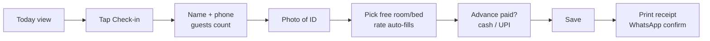
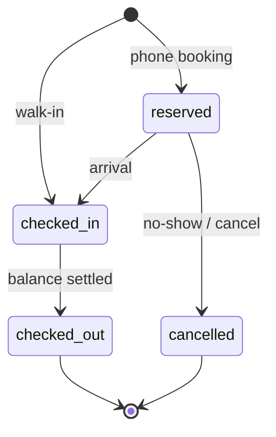

# Dharamshala PMS — PRD

2026-09-17 · @Someone

## 1. Overview

We are building a multi-tenant, mobile-first property management system (PMS) for dharamshalas and small hotels in India, starting with one pilot dharamshala that does 5–6 check-ins a day. Version 1 replaces the paper guest register, receipt book and month-end ledger; nothing more.

**Why now.** Existing PMS products (eZee, Hotelogix, Djubo) cost ₹25,000–₹1,20,000 a year and are designed for hotels with OTA channels. Dharamshalas run by trusts cannot justify that, so they still use paper. A ₹500–₹1,500/month product that works on a phone and needs no training is an open gap.

**Goals for v1**

1. A receptionist can complete a walk-in check-in in under 60 seconds on a phone.
2. The owner receives a daily collection and occupancy summary on WhatsApp every evening without asking anyone.
3. The police guest register and a GST-compliant receipt come out of the system, not from a separate book.
4. Total infrastructure cost stays under ₹2,000/month at 300+ properties.
5. One codebase serves every property (shared database, `property_id` on every row, Row Level Security).

**Non-goals for v1.** OTA/channel-manager sync, dynamic pricing, restaurant POS, accounting integration, native mobile apps, online guest self-booking. These are v2 or later.

## 2. Users and personas

Four people touch the product; the receptionist is the one it must win.

| Persona | Who they are | Device | What they need from v1 |
| --- | --- | --- | --- |
| Receptionist / munshi | Staff at the desk, often changes yearly, comfortable with WhatsApp, not with spreadsheets | Android phone or old laptop, patchy Wi-Fi | 60-second check-in, print a receipt, see who is leaving today, never lose an entry when the net drops |
| Manager | Runs the property day to day, answers phone bookings, handles cash | Same device + own phone | Today view, room availability, collect balances, correct mistakes, close the day |
| Trust owner / trustee | Rarely on site, wants control and no surprises | Own phone only | Evening WhatsApp summary, monthly report, who edited what (audit log) |
| Guest / pilgrim | Walk-in family or group, often older, Hindi-first | Own phone | A WhatsApp confirmation and a receipt; nothing to install |

**Language.** UI ships in Hindi and English with a one-tap toggle. All guest-facing messages are Hindi by default, configurable per property.

**Roles.** `owner` (all properties in the trust, billing, users), `manager` (one property, all operations, reports, corrections), `staff` (check-in/out, payments, housekeeping; cannot delete or edit past days). One super-admin role for us, to onboard properties and see health, never guest data by default.

## 3. Scope

V1 is the paper register, done properly. Everything that needs a second party (OTAs, gateways, accountants) waits for v2.

| Area | v1 (pilot, weeks 1–8) | v2 (after 3 paying properties) | Out of scope for now |
| --- | --- | --- | --- |
| Inventory | Rooms, room types, dormitory beds, rate card | Seasonal rates, blackout dates | Dynamic pricing |
| Bookings | Walk-in check-in, phone advance booking, tape chart | Direct booking page per property, iCal sync with Booking.com/Airbnb | Channel manager, OTA API |
| Guests | Guest profile, ID photo, group leader + member count | Returning-guest lookup by phone, DigiLocker ID verify | Loyalty, CRM campaigns |
| Money | Folio, charges, advances, cash/UPI/card marks, receipt | Razorpay/Cashfree payment links, refunds | Accounting integration (Tally), POS |
| Compliance | GST receipt/invoice, police guest register export, donation receipt | Form C for foreign nationals, e-invoice | ITC reconciliation |
| Housekeeping | Room status (dirty/clean/blocked) | Task assignment | Inventory/laundry |
| Reports | Today view, daily collection, occupancy, month summary | Custom date ranges, CSV export, owner dashboard | BI/analytics |
| Messaging | WhatsApp booking confirmation + daily owner report | Checkout thank-you, review request | Marketing broadcasts |
| Platform | Multi-tenant, roles, audit log, backups, PWA offline queue | Super-admin panel, in-app billing | Native apps, white-label |

## 4. Core user flows

Four flows cover 95% of a dharamshala's day. Each must work on a phone with one hand.

**Flow A — Walk-in check-in (target: under 60 seconds)**



Save creates guest, booking, folio and first payment in one transaction. If offline, Save queues locally and syncs when back; the receipt prints from the local copy.

**Flow B — Checkout**

Open the stay from Today view, review folio (room nights auto-calculated, extras added), collect balance (cash/UPI/card, split allowed), print final receipt, mark room dirty. Early or late checkout adjusts nights with manager approval.

**Flow C — Phone advance booking**

Manager enters name, phone, dates, room type, guest count and any advance received by UPI. Booking shows on the tape chart as `reserved`. WhatsApp confirmation goes to the guest with dates, amount and property address. Reserved rooms not checked in by a configurable hour (default 6 pm) are flagged, not auto-released.

**Flow D — Day close (automatic)**

At a configurable time (default 9 pm) the system computes the day's collections by mode, arrivals, departures, occupancy and outstanding balances, and sends it to the owner and manager on WhatsApp. No manual "close day" step in v1; corrections after 9 pm appear in the next day's report as adjustments.

**Booking states**



## 5. Functional requirements

Each requirement has an ID for tickets and an acceptance test. "Must" = v1 blocker.

**5.1 Property setup**

| ID | Requirement | Acceptance |
| --- | --- | --- |
| P1 | Must: create property with name, address, phone, GSTIN (optional), trust/registration number, check-in/checkout times, currency INR | Property saved; settings stored as JSONB, editable by owner/manager |
| P2 | Must: room types with default rate, max occupancy, `is_dormitory` flag and `bed_count` | A dormitory type sells beds individually; a room type sells the whole room |
| P3 | Must: rooms with number, floor, type, status | 80 rooms can be bulk-added from a range (e.g. 101–140) |
| P4 | Must: rate card per room type; extra-person charge; optional "donation / no fixed tariff" mode | Donation mode hides tax and prints a donation receipt instead of an invoice |
| P5 | Should: receipt template fields (header, footer, logo, 80G number) | Printed receipt shows them |

**5.2 Guests and ID**

| ID | Requirement | Acceptance |
| --- | --- | --- |
| G1 | Must: guest record = name, phone, city, ID type, ID photo, number of adults/children | Phone is the lookup key; same phone re-uses the guest |
| G2 | Must: ID photo captured from camera, compressed client-side to ≤ 300 KB, stored in object storage, never in Postgres | Photo viewable from the stay; deleted 2 years after checkout by a scheduled job |
| G3 | Must: never store full Aadhaar number; only ID type + last 4 digits + photo | Validation rejects 12-digit numeric entry in the ID field |
| G4 | Must: group booking = one leader guest + member count + optional member names | Police register lists members |

**5.3 Bookings and tape chart**

| ID | Requirement | Acceptance |
| --- | --- | --- |
| B1 | Must: walk-in check-in (Flow A) creates booking in `checked_in` state | Under 60 s on a mid-range Android, measured |
| B2 | Must: advance booking (Flow C) in `reserved` state with dates, room type, optional room | Shows on tape chart; can convert to check-in |
| B3 | Must: no overlapping bookings on the same room/bed | Enforced by a DB exclusion constraint, not only UI |
| B4 | Must: tape chart = rooms × 14 days, scroll left/right, tap a cell to act | Loads in < 1 s for 100 rooms |
| B5 | Must: change room, extend/shorten stay, cancel with reason | Every change written to audit log |
| B6 | Should: today view lists arrivals, in-house, departures, free rooms/beds | Default landing screen |

**5.4 Folio, payments, receipts**

| ID | Requirement | Acceptance |
| --- | --- | --- |
| F1 | Must: one folio per booking; lines = room nights (auto), extras, discounts, tax | Nights recalc when dates change |
| F2 | Must: payments with mode cash / UPI / card / bank, amount, reference, timestamp, user | Partial and multiple payments allowed |
| F3 | Must: GST auto: 5% on room tariff ≤ ₹7,500/night, 18% above; 0% in donation mode or when property has no GSTIN | Tax lines shown separately on receipt |
| F4 | Must: receipt/invoice PDF with sequential per-property number (`PREFIX/FY/0001`), printable on A4 and 58 mm thermal | Numbers never reused; voided receipts keep their number |
| F5 | Must: donation receipt template with 80G fields for trust-run properties | Selectable per property |
| F6 | Should: refund with reason, manager-only | Appears as negative payment |

**5.5 Housekeeping**

| ID | Requirement | Acceptance |
| --- | --- | --- |
| H1 | Must: room status `clean` / `dirty` / `blocked`; checkout sets `dirty` | Free-room list excludes `blocked` |
| H2 | Should: staff can flip status from a list view in one tap | No page reload |

**5.6 Reports and compliance**

| ID | Requirement | Acceptance |
| --- | --- | --- |
| R1 | Must: daily summary at 9 pm to owner/manager on WhatsApp: collections by mode, arrivals, departures, occupancy %, outstanding | Sent by scheduled job; visible in-app too |
| R2 | Must: police guest register export (PDF/CSV) for a date range in the format the local station accepts | Fields: name, address, ID type, arrival, departure, room, members |
| R3 | Must: month summary: revenue, tax, nights sold, occupancy, top payment modes | Exportable CSV |
| R4 | Should: outstanding balances list | Tap to open folio |

**5.7 Users, roles, audit**

| ID | Requirement | Acceptance |
| --- | --- | --- |
| U1 | Must: login by phone + OTP (SMS) or email + password; session lasts 30 days on a trusted device | No password resets over WhatsApp |
| U2 | Must: roles owner / manager / staff as in section 2 | Staff cannot edit past-day records |
| U3 | Must: append-only audit log of who changed what, old → new | Viewable by owner |
| U4 | Must: super-admin can create a property, invite an owner, view uptime and counts; guest data hidden unless the owner grants support access | Access logged |

## 6. Non-functional requirements

The product runs on cheap phones over bad networks; every requirement below follows from that.

| Area | Requirement |
| --- | --- |
| Devices | Installable PWA; works on Android Chrome (last 3 years) and desktop Chrome/Edge. Layout designed at 360 px width first. Tap targets ≥ 44 px. |
| Offline | Check-in, checkout and payment forms queue locally (IndexedDB) when offline and sync in order when back. Today view and tape chart cache the last 7 days. Receipt prints from local data. Conflicts (same room taken meanwhile) surface to the user, never silently overwrite. |
| Performance | Any screen interactive in < 2 s on a 4G connection; tape chart for 100 rooms × 14 days < 1 s server time; API p95 < 300 ms. |
| Availability | Target 99.5% monthly. Single-server acceptable in v1 because forms work offline; nightly backups tested monthly by restore. |
| Security | HTTPS only; OTP login; RLS on every tenant table; ID photos in private object storage served via short-lived signed URLs; secrets in environment, not code; rate-limit OTP and login. |
| Privacy / data | Guest data is the property's, not ours: exportable on request, deleted 90 days after a property leaves. ID photos auto-deleted 2 years after checkout. No Aadhaar numbers stored (G3). Comply with the DPDP Act 2023 basics: purpose limitation, consent notice at check-in, breach notification. |
| Auditability | Every write to bookings, folios, payments, rooms carries user, timestamp, before/after in `audit_log`. Receipt numbers are gap-free per property per financial year. |
| Localisation | Hindi and English UI strings from one JSON per language; dates shown `DD-MM-YYYY`; amounts in ₹ with Indian grouping (1,00,000); financial year April–March. |
| Accessibility | High-contrast default theme, font size toggle, no colour-only status (icons + labels). |
| Observability | Sentry for errors, Uptime Kuma ping every minute, daily backup success alert on WhatsApp/email to the team. |
| Scale | One shared Postgres; 300 properties on a 4 GB server, 2,000 on 8 GB with PgBouncer. No per-tenant infrastructure ever. |

## 7. Data model

One Postgres schema, shared tables, `property_id UUID NOT NULL` on every tenant table, Row Level Security on all of them. Money is `BIGINT` paise. Timestamps are `TIMESTAMPTZ`; stay dates are `DATE`.

| Table | Key columns | Notes |
| --- | --- | --- |
| `organisations` | id, name, gstin, pan, plan, billing\_status | A trust that runs several dharamshalas |
| `properties` | id, org\_id, name, address, phone, gstin, settings JSONB, timezone | settings = check-in time, receipt prefix, report hour, donation\_mode, language |
| `users` | id, phone, email, name, password\_hash | Global identity |
| `property_users` | property\_id, user\_id, role | role ∈ owner / manager / staff |
| `room_types` | id, property\_id, name, base\_rate\_paise, max\_occupancy, is\_dormitory, bed\_count, extra\_person\_paise |  |
| `rooms` | id, property\_id, room\_type\_id, number, floor, status | status ∈ clean / dirty / blocked |
| `beds` | id, room\_id, label | Only for dormitory rooms |
| `guests` | id, property\_id, name, phone, city, id\_type, id\_last4, id\_photo\_key, adults, children | phone indexed per property |
| `bookings` | id, property\_id, guest\_id, state, check\_in, check\_out, source, member\_count, notes, created\_by | state ∈ reserved / checked\_in / checked\_out / cancelled |
| `booking_units` | id, booking\_id, room\_id, bed\_id NULL, rate\_paise, check\_in, check\_out | One row per room or bed in the stay |
| `folios` | id, booking\_id, property\_id, status, total\_paise, paid\_paise | Cached totals, recomputed on write |
| `folio_lines` | id, folio\_id, kind, description, qty, unit\_paise, tax\_rate\_bp, tax\_paise, line\_date | kind ∈ room\_night / extra / discount / tax / adjustment |
| `payments` | id, folio\_id, property\_id, mode, amount\_paise, reference, received\_at, received\_by, is\_refund | mode ∈ cash / upi / card / bank |
| `receipts` | id, property\_id, folio\_id, number, fy, kind, pdf\_key, voided\_at | number gap-free per property per fy; kind ∈ invoice / donation |
| `audit_log` | id, property\_id, user\_id, table\_name, row\_id, action, before JSONB, after JSONB, at | Append-only; no UPDATE/DELETE grants |
| `outbox` | id, property\_id, channel, payload JSONB, status, attempts, send\_after | WhatsApp/SMS/email queue with retries |

**Constraints that matter**

```sql
-- no double booking, enforced in the database
ALTER TABLE booking_units ADD CONSTRAINT no_overlap
  EXCLUDE USING gist (
    COALESCE(bed_id, room_id) WITH =,
    daterange(check_in, check_out, '[)') WITH &&
  ) WHERE (cancelled_at IS NULL);

-- tenant isolation on every tenant table
ALTER TABLE bookings ENABLE ROW LEVEL SECURITY;
CREATE POLICY tenant ON bookings
  USING (property_id = current_setting('app.property_id')::uuid);

-- gap-free receipt numbers
CREATE TABLE receipt_counters (property_id uuid, fy text, last int,
  PRIMARY KEY (property_id, fy));
-- increment with SELECT ... FOR UPDATE inside the receipt transaction
```

**Indexes.** `(property_id, check_in)` and `(property_id, state)` on bookings; `(property_id, phone)` on guests; `(property_id, received_at)` on payments; `(property_id, at)` on audit\_log. The app sets `app.property_id` at the start of every request from the session; the super-admin role uses a separate DB role with RLS bypass and its own audit trail.

## 8. Integrations

Only WhatsApp and object storage are v1 blockers; everything else has a zero-cost fallback.

| Integration | Provider | Used for | Cost | Phase |
| --- | --- | --- | --- | --- |
| WhatsApp | Meta Cloud API direct (no BSP) | Booking confirmation, daily owner report, receipt PDF | Utility template ≈ ₹0.115 + 18% GST per message outside the 24 h window; replies inside the window free | v1 |
| Object storage | Cloudflare R2 | ID photos, receipt PDFs, DB backups | 10 GB free, then ≈ ₹1.2/GB/month; no egress fees | v1 |
| SMS OTP | MSG91 (or Fast2SMS) | Login OTP only | ≈ ₹0.20/SMS | v1 |
| Email | Brevo free tier | OTP fallback, monthly report, team alerts | 300/day free | v1 |
| PDF | Server-side HTML → PDF (Playwright/Chromium or wkhtmltopdf) | Receipts, police register, reports | ₹0 | v1 |
| Printing | Browser print; 58 mm and A4 CSS templates | Thermal and inkjet receipts | ₹0 | v1 |
| UPI collection | Static UPI QR (property's own VPA) shown on screen/receipt; manual "mark paid" | Zero-fee collection | ₹0 | v1 |
| Payment gateway | Razorpay or Cashfree payment links | Advance for phone bookings, card payments | ≈ 2% + GST per txn, passed to property | v2 |
| Calendar sync | iCal import/export | Booking.com / Airbnb availability without a channel manager | ₹0 | v2 |
| ID verification | DigiLocker | Verified ID without storing numbers | TBD | v2 |
| Accounting | Tally XML export | Accountant hand-off | ₹0 | v2 |
| Error / uptime | Sentry free, Uptime Kuma self-hosted | Ops | ₹0 | v1 |

**WhatsApp templates to register in v1** (utility category): `booking_confirmed`, `checkin_receipt`, `checkout_receipt`, `daily_summary_owner`. Keep body variables to dates, amounts, names and the property phone; no promotional text, or Meta reclassifies it as marketing at ₹0.86.

**Outbox pattern.** Every outbound message is a row in `outbox`; a worker sends with exponential backoff and marks status. Nothing is sent inside a request transaction, so a WhatsApp outage never blocks a check-in.

## 9. Tech stack and infrastructure

One VPS, one Postgres, one Docker Compose file. Recurring infrastructure lands at about ₹600/month and stays under ₹2,000 past 300 properties.

**Stack (recommended default; swap the app layer for Django + HTMX if the team is Python-first)**

| Layer | Choice | Why |
| --- | --- | --- |
| Frontend | Next.js (App Router) + TypeScript, Tailwind, PWA via `next-pwa`, IndexedDB queue via Dexie | One codebase for phone and desktop; offline queue is a solved problem |
| API | Next.js route handlers (or a small Fastify service) with Zod validation | Same repo, same types end to end |
| ORM / migrations | Drizzle ORM + drizzle-kit migrations, SQL reviewed before apply | Thin over Postgres; RLS and exclusion constraints stay visible |
| Database | Postgres 16 in Docker, PgBouncer in transaction mode | Section 7 |
| Jobs | `pg-boss` (Postgres-backed queue) for outbox, daily report, photo purge | No Redis to run |
| Auth | Phone OTP via MSG91 + signed HTTP-only session cookie; email/password fallback | No third-party auth bill |
| PDF | Playwright/Chromium in a sidecar container | Same HTML as the screen |
| Reverse proxy | Caddy | Automatic HTTPS |
| Deploy | Coolify on the VPS, deploy on push to `main` | Free Heroku-like flow |
| CI | GitHub Actions: lint, type-check, migration dry-run, Playwright smoke test | Free tier |

**Infrastructure and monthly cost**

| Item | Choice | ₹/month (approx.) |
| --- | --- | --- |
| Server | Hetzner CX23, 4 GB RAM, 40 GB SSD, Singapore region | 400–450 |
| Server snapshots | Hetzner backup add-on (20%) | 80–90 |
| DNS / CDN / TLS / DDoS | Cloudflare free | 0 |
| Object storage + DB backups | Cloudflare R2 free tier | 0 |
| Email | Brevo free | 0 |
| Errors / uptime | Sentry free + Uptime Kuma | 0 |
| Domain | .in, annual amortised | 80 |
| WhatsApp / SMS | Usage; ≈ ₹30 per property per month at 200 messages | variable |
| **Total fixed** |  | **≈ 600** |

Growth path: CX33 (8 GB, ≈ ₹650) at \~300 properties → Postgres on its own CX23 → read replica → managed Postgres only when revenue makes it boring. Every step is a dump/restore of vanilla Postgres.

**Backups.** Nightly `pg_dump` + gzip to R2 via rclone, 30 daily and 12 monthly retained; monthly restore drill into a scratch container with a checklist ticket. WAL shipping (pgBackRest) added in v2 for point-in-time recovery.

**Repo layout**

```
apps/web        Next.js app (UI + API routes)
packages/db     Drizzle schema, migrations, RLS policies, seed
packages/jobs   pg-boss workers: outbox, daily_report, purge_photos
packages/pdf    receipt / register templates
infra/          docker-compose.yml, Caddyfile, backup.sh, coolify notes
```

## 10. Pricing and billing

Flat per-property plans, everything included, annual preferred. The pilot property pays nothing for three months and is told the post-pilot price on day one.

| Plan | Property size | Monthly | Annual (2 months free) | Onboarding (one-time) |
| --- | --- | --- | --- | --- |
| Basic | up to 20 rooms | ₹499 | ₹5,000 | ₹2,000 (waived for pilot and referrals) |
| Standard | 21–60 rooms | ₹999 | ₹10,000 | ₹3,000 |
| Large | 61+ rooms | ₹1,499 | ₹15,000 | ₹5,000 |

WhatsApp and SMS usage beyond 300 messages/month is billed at cost + 20% (≈ ₹0.15 per message), shown on the invoice. Payment gateway fees (v2) pass through to the property.

**Billing in v1 is manual**: super-admin sets `plan` and `billing_status` on the organisation; a UPI/bank invoice PDF is generated and sent on WhatsApp; unpaid after 15 days shows a banner, after 45 days the property becomes read-only (never deleted). In-app Razorpay subscriptions come with v2.

**Unit economics.** Fixed infra ≈ ₹600/month for all properties. Break-even at the second Standard customer; 10 properties ≈ ₹10,000/month, 50 ≈ ₹50,000/month on the same server.

## 11. Build plan

Eight weeks to a pilot that runs the desk daily; one developer full-time, one part-time on onboarding and design. Weeks are calendar weeks from kick-off.

| Week | Deliverable | Done when |
| --- | --- | --- |
| 0 | Two days at the pilot desk: photograph register, receipts, rate card; write the check-in script; confirm device and printer | Findings pasted into section 13 and requirements adjusted |
| 1 | Repo, Docker Compose, Postgres + PgBouncer, Drizzle schema for section 7, RLS policies, seed data, Coolify deploy, Caddy TLS | `https://app.<domain>` serves a health page from the VPS |
| 2 | Auth (OTP + session), property setup, room types, rooms, beds, rate card (P1–P4) | Pilot property configured with its real rooms |
| 3 | Walk-in check-in (Flow A), guest + ID photo to R2, today view (B1, G1–G4, B6) | 60-second check-in measured on the pilot's phone |
| 4 | Folio, payments, GST, receipt PDF with gap-free numbers, 58 mm + A4 print (F1–F5) | Receipt prints on the pilot's printer |
| 5 | Checkout (Flow B), advance booking (Flow C), tape chart, exclusion constraint (B2–B5) | No double booking possible from UI or API |
| 6 | Housekeeping status, audit log, roles, staff restrictions (H1, U2–U3) | Manager can see who changed what |
| 7 | WhatsApp: templates approved, outbox worker, booking confirmation, 9 pm daily report (R1); police register export (R2); month summary (R3) | Owner receives the first real 9 pm report |
| 8 | PWA offline queue, Hindi strings, backups to R2 + restore drill, Sentry, Uptime Kuma; go-live at the pilot | Desk runs a full day on the system with the paper register as backup only |
| 9–12 | Pilot support: fix what the desk complains about within 48 h; weekly call with the manager; collect referral | Manager says they would not go back to paper |
| 13+ | v2 per section 3, starting with direct booking page and payment links | Three paying properties |

**Definition of done for every feature:** works on 360 px Android Chrome, works offline where section 6 requires, writes audit log, has a Playwright smoke test, Hindi strings present.

## 12. Success metrics

The pilot succeeds when the paper register stops being updated. Measure these from week 9.

| Metric | Pilot target (week 12) | Launch target (month 6) |
| --- | --- | --- |
| Check-ins recorded in the system vs. actual arrivals | ≥ 95% | ≥ 98% across properties |
| Median check-in time (first tap to receipt) | ≤ 60 s | ≤ 45 s |
| Days the 9 pm owner report was sent on time | 100% | ≥ 99.5% |
| Receipts printed from the system vs. receipt book | 100% | 100% |
| Offline-queued entries that synced without conflict | ≥ 99% | ≥ 99% |
| Bugs reported by the desk, fixed within 48 h | 100% | ≥ 90% |
| Paying properties | 1 (pilot converts) | 10 |
| Monthly infra cost | ≤ ₹700 | ≤ ₹1,000 |
| Uptime | ≥ 99.5% | ≥ 99.5% |
| Referrals from existing properties | 1 | 30% of new sign-ups |

## 13. Assumptions, risks and open questions

**Assumptions made in this PRD** (confirm at the pilot desk in week 0)

1. The desk has an Android phone or a laptop with Chrome and some internet most of the day.
2. Most guests are walk-ins; phone advance bookings are a minority.
3. The property issues receipts today, on a receipt book, and the trust wants sequential numbers.
4. The local police station accepts a printed register in a standard tabular format.
5. The team can build in TypeScript/Next.js; otherwise swap to Django + HTMX with the same data model.

**Risks**

| Risk | Impact | Mitigation |
| --- | --- | --- |
| Receptionist keeps using the paper register in parallel and the system drifts | Pilot fails silently | Owner's 9 pm report only counts system entries; manager audits weekly; paper becomes backup only from week 9 |
| WhatsApp template approval delays (Meta review can take days) | Week 7 slips | Submit templates in week 2; email fallback for daily report |
| Single server outage | Desk cannot see today view | Offline cache of 7 days + queued writes; snapshot restore under 30 min |
| Thermal printer incompatibility | Receipts fail at go-live | Test the pilot's exact printer in week 4; A4 fallback |
| GST slab or rules change | Wrong tax on receipts | Tax rates in property settings, not code; effective-dated |
| Staff turnover | Retraining every season | 5-minute Hindi video walkthrough; UI needs no manual |
| Scope creep from the pilot's wish list | v1 never ships | Everything new goes to the v2 column in section 3 unless it blocks a daily flow |

**Open questions**

- [ ] Does the pilot take phone advance bookings, and how many per week? (Decides whether the tape chart ships in week 5 or moves to v2.)
- [ ] Is the pilot GST-registered, donation-based, or both?
- [ ] Which printer and paper size does the desk use today?
- [ ] What does the local police station currently accept as the guest register?
- [ ] Team stack: TypeScript/Next.js or Python/Django?
- [ ] Product name and domain.

  | ☐ |  |  |
  | --- | --- | --- |
  |  |  |  |
  |  |  |  |
