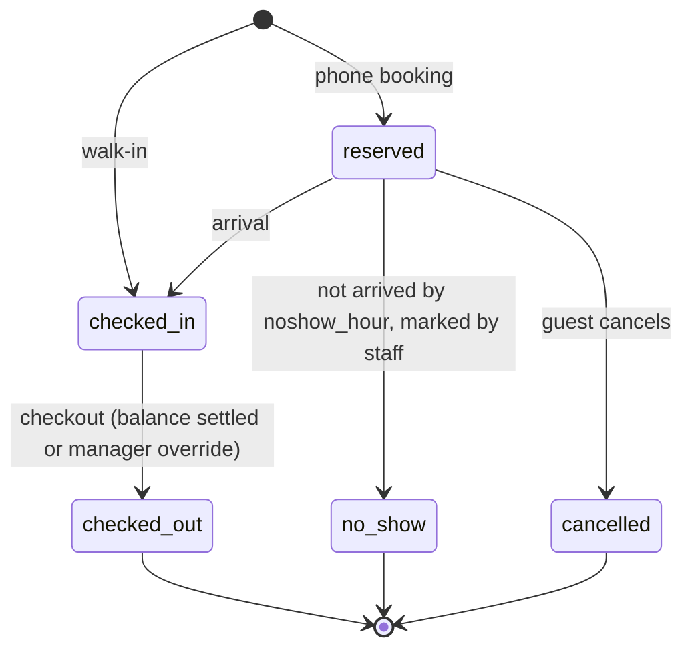

# Dharamshala PMS — PRD

2026-09-17 · Revised 2026-09-17 after review

## 1. Overview

We are building a multi-tenant, mobile-first property management system (PMS) for dharamshalas and small hotels in India, starting with one pilot dharamshala that does 5–6 check-ins a day. Version 1 replaces the paper guest register, receipt book and month-end ledger; nothing more.

**Why now.** Existing PMS products (eZee, Hotelogix, Djubo) cost ₹25,000–₹1,20,000 a year and are designed for hotels with OTA channels. Dharamshalas run by trusts cannot justify that, so they still use paper. A ₹500–₹1,500/month product that works on a phone and needs no training is an open gap.

**Goals for v1**

1. A receptionist can complete a walk-in check-in in under 60 seconds on a phone.
2. The owner receives a daily collection and occupancy summary on WhatsApp every evening without asking anyone.
3. The police guest register and a GST-compliant receipt come out of the system, not from a separate book.
4. Total infrastructure cost stays under ₹2,000/month at 300+ properties.
5. One codebase serves every property (shared database, `property_id` on every row, Row Level Security).

**Configuration principle.** Every rule that differs between properties is a per-property setting with a sensible default, changeable by the owner or manager from the app without a deploy. Every rule that a regulator can change (tax slabs, exemption thresholds, retention periods, register columns) is effective-dated data, not code. Code carries the default, never the only value. Section 14 lists every setting; a feature that needs a new rule adds a row there before it adds an `if` in code.

**Non-goals for v1.** OTA/channel-manager sync, dynamic pricing, restaurant POS, accounting integration, native mobile apps, online guest self-booking. These are v2 or later.

**Relationship to the existing repo.** The current `Prestige PMS` code in this repository is a desktop dashboard prototype with mock data, no database, no auth and no offline support. It is not the v1 codebase. UI primitives (cards, badges, status chips) may be reused; the rest is replaced by the build plan in section 11.

## 2. Users and personas

Four people touch the product; the receptionist is the one it must win.

| Persona | Who they are | Device | What they need from v1 |
| --- | --- | --- | --- |
| Receptionist / munshi | Staff at the desk, often changes yearly, comfortable with WhatsApp, not with spreadsheets | Android phone or old laptop, patchy Wi-Fi | 60-second check-in, print a receipt, see who is leaving today, never lose an entry when the net drops |
| Manager | Runs the property day to day, answers phone bookings, handles cash | Same device + own phone | Today view, room availability, collect balances, correct mistakes, approve exceptions, close the shift |
| Trust owner / trustee | Rarely on site, wants control and no surprises | Own phone only | Evening WhatsApp summary, monthly report, who edited what (audit log), change any rule without calling us |
| Guest / pilgrim | Walk-in family or group, often older, Hindi-first | Own phone | A WhatsApp confirmation and a receipt; nothing to install |

**Language.** UI ships in Hindi and English with a one-tap toggle; the property's `languages` setting controls which are offered and which is default. Additional languages are one JSON file each. Guest-facing messages use the property's `guest_language`.

**Roles.** `owner` (all properties in the organisation, billing, users, all settings), `manager` (one property, all operations, reports, corrections, approvals, operational settings), `staff` (check-in/out, payments, housekeeping; cannot delete, and cannot edit records older than the `staff_edit_window`, default the current business day). One super-admin role for us, to onboard properties and see health, never guest data unless the owner grants time-boxed support access.

**One login per person.** Shared logins make the audit log meaningless. Inviting a staff member costs one phone number and one tap; deactivating a user revokes every session they hold.

**Approvals.** Actions marked "manager approval" in this document are unlocked by the `approval_mode` setting: `pin` (manager enters a PIN on the staff device, default) or `queue` (staff request, manager approves from their own phone). Both write the approver to the audit log.

## 3. Scope

V1 is the paper register, done properly. Everything that needs a second party (OTAs, gateways, accountants) waits for v2.

| Area | v1 (pilot, weeks 1–8) | v2 (after 3 paying properties) | Out of scope for now |
| --- | --- | --- | --- |
| Inventory | Rooms, room types, dormitory beds, rate card, per-property billing mode | Seasonal rates, blackout dates | Dynamic pricing |
| Bookings | Walk-in check-in, phone advance booking, day-use stays, tape chart | Direct booking page per property, iCal sync with Booking.com/Airbnb | Channel manager, OTA API |
| Guests | Guest profile, returning-guest lookup by phone, ID photo, group leader + members, nationality | DigiLocker ID verify | Loyalty, CRM campaigns |
| Money | Folio, charges, deposits, advances, cash/UPI/card/bank/cheque marks, refunds, credit notes, receipt | Razorpay/Cashfree payment links | Accounting integration (Tally), POS |
| Compliance | GST invoice with CGST/SGST split, effective-dated tax rules, police guest register export (PDF/CSV, configurable columns), donation receipt, passport capture for foreign guests | Form C filing, e-invoice | ITC reconciliation |
| Housekeeping | Room status (dirty/clean/blocked) | Task assignment | Inventory/laundry |
| Reports | Today view, daily collection by business day, shift cash summary, occupancy, month summary with GST breakup, CSV export | Custom date ranges, owner dashboard across properties | BI/analytics |
| Messaging | WhatsApp booking confirmation + daily owner report, opt-in at check-in | Checkout thank-you, review request | Marketing broadcasts |
| Platform | Multi-tenant, roles, audit log, backups, PWA offline queue, settings registry | Super-admin panel, in-app billing | Native apps, white-label |

## 4. Core user flows

Four flows cover 95% of a dharamshala's day. Each must work on a phone with one hand.

**Flow A — Walk-in check-in (target: under 60 seconds)**


Typing a phone number shows an existing guest to reuse. The consent notice is one line of property-configured text with a single tap; it also captures WhatsApp opt-in (`consent_required`, `consent_text`). The ID photo step is shown when `id_photo_required` is on (default on) and can be skipped with a reason that is logged. Save creates guest, booking, folio, first payment and any deposit in one transaction. If offline, Save queues locally with a client-generated UUID and syncs when back; the receipt prints from the local copy according to `offline_receipt_mode` (section 5.4, F4).

**Flow B — Checkout**

Open the stay from Today view, review folio (room charges auto-calculated per the property's `billing_mode`, extras added), refund the deposit or apply it to the balance, collect the balance (cash/UPI/card/bank/cheque, split allowed), print final invoice, mark room dirty. Early or late checkout adjusts charges; when the adjustment is a reduction it needs manager approval (section 2).

**Flow C — Phone advance booking**

Manager enters name, phone, dates, room type, guest count and any advance received by UPI. Booking shows on the tape chart as `reserved`. WhatsApp confirmation goes to the guest with dates, amount and property address. Reserved rooms not checked in by `noshow_hour` (default 18:00) are flagged, not auto-released. Marking a reservation `no_show` applies the property's `noshow_policy` to the advance: `forfeit` (default), `refund`, or `partial` with a configured percentage.

**Flow D — Day close (automatic)**

A business day runs from `business_day_start` (default 21:00) to the same hour next day. At that hour the system computes the day's collections by mode and by user, arrivals, departures, occupancy and outstanding balances, stores the report, and sends it to the owner and manager on WhatsApp (email fallback). Late-night arrivals belong to the day that is open when they happen, so the report matches the cash box. Edits to a closed day appear in the next report as adjustments. No manual "close day" step in v1.

**Booking states**



A folio has its own status: `open`, `settled`, `written_off` (manager approval). A booking can be `checked_out` with an `open` folio; it then appears in the outstanding list.

## 5. Functional requirements

Each requirement has an ID for tickets and an acceptance test. "Must" = v1 blocker. Setting names in backticks are defined in section 14.

**5.1 Property setup**

| ID | Requirement | Acceptance |
| --- | --- | --- |
| P1 | Must: create property with name, address, phone, GSTIN (optional), trust/registration number, 12A/80G numbers (optional), UPI VPA and payee name, check-in/checkout times, timezone, currency INR | Property saved; settings stored as JSONB validated by one schema, editable by owner/manager, every change audited |
| P2 | Must: room types with default rate, max occupancy, `is_dormitory` flag and `bed_count`, extra-person charge | A dormitory type sells beds individually; a room type sells the whole room; `dorm_whole_room_allowed` off by default |
| P3 | Must: rooms with number, floor, type, status | 80 rooms can be bulk-added from a range (e.g. 101–140) |
| P4 | Must: rate card per room type; `billing_mode` per property: `night` (charge per night, fixed `checkout_time`), `24h` (charge per 24 hours from arrival), with `day_use_allowed` and `day_use_rate_pct` | A stay's charges recompute correctly under each mode; day-use stays are one chargeable unit, never zero |
| P5 | Must: tax rules per property as effective-dated data: slabs by rate per unit per day, exemption threshold, `tax_exempt` override, `donation_mode` | Changing a slab or threshold takes effect from its date without a deploy; old invoices are unchanged |
| P6 | Should: receipt template fields (header, footer, logo, 80G number, terms) | Printed receipt shows them |
| P7 | Must: settings registry (section 14) exposed as a settings screen grouped by area, with defaults shown and a "reset to default" per setting | Every setting in section 14 is editable by the role listed; no other behaviour is property-specific |

**5.2 Guests and ID**

| ID | Requirement | Acceptance |
| --- | --- | --- |
| G1 | Must: guest record = name, phone, city, nationality (default IN), ID type, ID last 4, ID photo, adults/children; passport number, visa number and expiry when nationality is not IN | Phone is the lookup key per property; same phone re-uses the guest; foreign guests have the fields Form C needs |
| G2 | Must: ID photo captured from camera, compressed client-side to ≤ `id_photo_max_kb` (default 300), stored in object storage, never in Postgres; deleted `id_photo_retention_days` (default 730) after checkout by a scheduled job | Photo viewable from the stay via signed URL; purge job logs each deletion |
| G3 | Must: never store a full Aadhaar number; only ID type + last 4 + photo. The capture screen asks for masked Aadhaar and offers a client-side blur box over the number before upload | Validation rejects any 12-digit sequence in the ID field; blur is applied before the file leaves the device |
| G4 | Must: group booking = one leader guest + member count + member names; names required for adults when `register_requires_all_names` is on (default on) | Police register lists every named member |
| G5 | Must: consent notice at check-in with property text; captures DPDP consent and WhatsApp opt-in with timestamp | Consent stored on the booking; no business-initiated WhatsApp without opt-in |

**5.3 Bookings and tape chart**

| ID | Requirement | Acceptance |
| --- | --- | --- |
| B1 | Must: walk-in check-in (Flow A) creates booking in `checked_in` state | Under 60 s on a mid-range Android, measured by in-app timing from first tap to receipt |
| B2 | Must: advance booking (Flow C) in `reserved` state with dates, room type, optional room; when no room is chosen a unit of that type is held so the constraint still protects it | Shows on tape chart; can convert to check-in |
| B3 | Must: no overlapping bookings on the same room/bed, using timestamp ranges so same-day stays are covered | Enforced by a DB exclusion constraint, not only UI; a day-use and an overnight stay on the same unit cannot overlap |
| B4 | Must: tape chart = rooms × `tape_chart_days` (default 14), scroll left/right, tap a cell to act | Loads in < 1 s for 100 rooms |
| B5 | Must: change room, extend/shorten stay, cancel with reason, mark no-show | Every change written to audit log; reductions need manager approval |
| B6 | Must: today view lists arrivals, in-house, departures, free rooms/beds, flagged no-shows | Default landing screen |

**5.4 Folio, payments, receipts**

| ID | Requirement | Acceptance |
| --- | --- | --- |
| F1 | Must: one folio per booking; line kinds `room_charge`, `day_use`, `extra`, `discount`, `deposit`, `deposit_refund`, `forfeit`, `adjustment`; each taxable line carries `tax_rate_bp`, `cgst_paise`, `sgst_paise` | Charges recalc when dates change; tax lives on the line, never as a separate line; totals equal the sum of lines |
| F2 | Must: payments with mode cash / UPI / card / bank / cheque, amount, reference, timestamp, user, device | Partial and multiple payments allowed |
| F3 | Must: tax engine is a pure function of (tax rules in force on the line date, line kind, unit rate per day). Default rules: 0% when no GSTIN, `tax_exempt` or `donation_mode`; 0% when the rate is below `exemption_threshold_paise` and `religious_precinct` is on; otherwise slab lookup (default 5% up to ₹7,500, 18% above) | Every branch unit-tested; boundary at exactly the slab edge tested; CGST and SGST shown separately on the invoice |
| F4 | Must: invoice PDF with sequential per-property number from `receipt_number_format` (default `{PREFIX}/{FY}/{SEQ:4}`, validated ≤ 16 characters), gap-free per financial year, with an immutable snapshot of lines and tax at issue time. Offline behaviour per `offline_receipt_mode`: `provisional` (default; prints a provisional receipt, invoice issued on sync and sent on WhatsApp) or `device_block` (each device reserves `offline_block_size` numbers) | Numbers never reused or skipped; a re-render of an old invoice is identical; offline check-ins never produce two invoices |
| F5 | Must: credit note against an invoice for corrections and refunds after issue; the original is never edited or voided | Credit note has its own gap-free sequence and references the invoice |
| F6 | Must: donation receipt template with 80G fields, used when `donation_mode` is on. The setting carries a confirmation that the trust has checked this with its CA | Selectable per property; cannot be turned on without the confirmation |
| F7 | Must: refund with reason, manager approval; appears as negative payment and, after invoice, as a credit note | Refund cannot exceed paid amount |
| F8 | Must: refundable deposits (key, bedding) as `deposit` lines outside revenue and tax, refunded or applied at checkout | Daily report shows deposits held separately from collections |
| F9 | Should: print on `printer_profile`: `thermal_58`, `thermal_80`, `a4` | Each profile has its own CSS template |

**5.5 Housekeeping**

| ID | Requirement | Acceptance |
| --- | --- | --- |
| H1 | Must: room status `clean` / `dirty` / `blocked`; checkout sets `dirty`; `dirty_rooms_assignable` (default on, with warning) | Free-room list excludes `blocked` |
| H2 | Should: staff can flip status from a list view in one tap | No page reload |

**5.6 Reports and compliance**

| ID | Requirement | Acceptance |
| --- | --- | --- |
| R1 | Must: business-day summary at `business_day_start` to owner/manager on WhatsApp (email fallback): collections by mode and by user, deposits held, arrivals, departures, no-shows, occupancy %, outstanding | Sent by scheduled job; stored and visible in-app; matches the cash box for that window |
| R2 | Must: police guest register export (PDF/CSV) for a date range; columns and order from `register_template` (default: serial, name, address/city, nationality, ID type + last 4, arrival, departure, room/bed, adults, children, member names, purpose) | Template editable per property without a deploy |
| R3 | Must: month summary: revenue, taxable value by rate, CGST/SGST totals, nights sold, occupancy, payments by mode, refunds, credit notes, outstanding | Exportable CSV that a CA can file GSTR-1 from |
| R4 | Must: outstanding balances list | Tap to open folio |
| R5 | Must: shift cash summary: cash received per user since their last handover, with a "hand over" action that snapshots the figure | Manager sees who holds how much cash right now |

**5.7 Users, roles, audit**

| ID | Requirement | Acceptance |
| --- | --- | --- |
| U1 | Must: login by phone + OTP (SMS) or email + password; session lasts `session_days` (default 30) on a trusted device; owner can see and revoke sessions; deactivating a user revokes all their sessions | No password resets over WhatsApp; a deactivated user is logged out within one minute |
| U2 | Must: roles owner / manager / staff as in section 2; staff edits limited by `staff_edit_window` | Enforced server-side, not only hidden in UI |
| U3 | Must: append-only audit log of who changed what, old → new, including settings changes and approvals | Viewable by owner and manager |
| U4 | Must: super-admin can create a property, invite an owner, view uptime and counts; guest data hidden unless the owner grants support access with an expiry | Every admin read logged |
| U5 | Must: manager approval per `approval_mode` (section 2) | Approver recorded on the audited change |

## 6. Non-functional requirements

The product runs on cheap phones over bad networks; every requirement below follows from that.

| Area | Requirement |
| --- | --- |
| Devices | Installable PWA; works on Android Chrome (last 3 years) and desktop Chrome/Edge. Layout designed at 360 px width first. Tap targets ≥ 44 px. |
| Offline | Check-in, checkout, payment and housekeeping forms queue locally (IndexedDB) when offline and sync in order when back. Every write carries a client-generated UUID that the API treats as an idempotency key, from the first write path onwards. Today view and tape chart cache the last `offline_cache_days` (default 7). Receipts follow `offline_receipt_mode`. Conflicts (same unit taken meanwhile) surface in a "needs attention" list, never silently overwrite. |
| Printing | Supported paths, documented in the settings screen: (a) laptop + USB/Wi-Fi printer via browser print; (b) Android + Bluetooth thermal printer via a print-service app (RawBT or the vendor plugin); (c) Android + Wi-Fi printer with a Mopria-compatible service. Browser print alone does not reach Bluetooth thermal printers; the pilot's exact printer is verified in week 0. |
| Performance | Any screen interactive in < 2 s on a 4G connection; tape chart for 100 rooms × 14 days < 1 s server time; API p95 < 300 ms. |
| Availability | Target 99.5% monthly. Single-server acceptable in v1 because forms work offline; nightly backups tested monthly by restore. |
| Security | HTTPS only; OTP login rate-limited; RLS on every tenant table with the tenant id applied by `SET LOCAL` inside each transaction (required with PgBouncer transaction pooling); ID photos in private object storage served via short-lived signed URLs; secrets in environment, not code. |
| Privacy / data | Guest data is the property's, not ours: exportable on request, deleted `org_data_retention_days` (default 90) after a property leaves. ID photos purged per G2. No Aadhaar numbers stored (G3). DPDP Act 2023 basics: purpose limitation, consent notice at check-in (G5), breach notification. Confirm the DPDP rules' effective dates with counsel; build the consent step regardless. |
| Auditability | Every write to bookings, units, folios, lines, payments, receipts, rooms, settings carries user, timestamp, before/after in `audit_log`. Invoice and credit-note numbers are gap-free per property per financial year. |
| Localisation | UI strings from one JSON per language; `languages` and `guest_language` per property; dates `DD-MM-YYYY`; amounts in ₹ with Indian grouping (1,00,000); financial year April–March. Adding a language is a file, not a release. |
| Accessibility | High-contrast default theme, font size toggle, no colour-only status (icons + labels). |
| Observability | Sentry for errors (PII scrubbed), Uptime Kuma ping every minute, daily backup success alert on WhatsApp/email to the team. |
| Scale | One shared Postgres; 300 properties on an 8 GB server, 2,000 with a separate DB host and PgBouncer. No per-tenant infrastructure ever. |

## 7. Data model

One Postgres schema, shared tables, `property_id UUID NOT NULL` on every tenant table (including `beds`, `booking_units`, `folio_lines`), Row Level Security on all of them. Money is `BIGINT` paise. All times are `TIMESTAMPTZ`; stay boundaries are timestamps so day-use and 24-hour billing work.

| Table | Key columns | Notes |
| --- | --- | --- |
| `organisations` | id, name, gstin, pan, plan, billing\_status | A trust that runs several dharamshalas |
| `properties` | id, org\_id, name, address, phone, gstin, settings JSONB, timezone | settings = every key in section 14, validated by one schema |
| `users` | id, phone, email, name, password\_hash, active | Global identity |
| `sessions` | id, user\_id, device\_name, created\_at, expires\_at, revoked\_at | Owner-visible, revocable |
| `property_users` | property\_id, user\_id, role, approval\_pin\_hash | role ∈ owner / manager / staff |
| `devices` | id, property\_id, name, offline\_block\_start, offline\_block\_end | Used when `offline_receipt_mode = device_block` |
| `room_types` | id, property\_id, name, base\_rate\_paise, max\_occupancy, is\_dormitory, bed\_count, extra\_person\_paise |  |
| `rooms` | id, property\_id, room\_type\_id, number, floor, status | status ∈ clean / dirty / blocked |
| `beds` | id, property\_id, room\_id, label | Only for dormitory rooms |
| `guests` | id, property\_id, name, phone, city, nationality, id\_type, id\_last4, id\_photo\_key, passport\_no, visa\_no, visa\_expiry, adults, children | phone indexed per property |
| `bookings` | id, property\_id, guest\_id, state, arrive\_at, depart\_at, source, member\_count, notes, consent\_at, whatsapp\_opt\_in, created\_by | state ∈ reserved / checked\_in / checked\_out / no\_show / cancelled |
| `booking_members` | id, property\_id, booking\_id, name, is\_adult, id\_type, id\_last4 | Group members for the register |
| `booking_units` | id, property\_id, booking\_id, room\_id, bed\_id NULL, rate\_paise, arrive\_at, depart\_at, auto\_assigned, cancelled\_at | One row per room or bed in the stay |
| `folios` | id, property\_id, booking\_id, status, total\_paise, paid\_paise, deposit\_held\_paise | status ∈ open / settled / written\_off; cached totals recomputed on write |
| `folio_lines` | id, property\_id, folio\_id, kind, description, qty, unit\_paise, tax\_rate\_bp, cgst\_paise, sgst\_paise, line\_date, approved\_by | kind ∈ room\_charge / day\_use / extra / discount / deposit / deposit\_refund / forfeit / adjustment |
| `payments` | id, property\_id, folio\_id, mode, amount\_paise, reference, received\_at, received\_by, device\_id, is\_refund, handover\_id | mode ∈ cash / upi / card / bank / cheque |
| `cash_handovers` | id, property\_id, user\_id, amount\_paise, at, counted\_by | R5 |
| `receipts` | id, property\_id, folio\_id, kind, number, fy, snapshot JSONB, pdf\_key, references\_receipt\_id, issued\_at | kind ∈ invoice / donation / credit\_note / provisional; number gap-free per property per fy per kind |
| `receipt_counters` | property\_id, fy, kind, last | Locked with `SELECT … FOR UPDATE` in the issuing transaction |
| `tax_rules` | id, property\_id, effective\_from, rules JSONB | Slabs, exemption threshold, flags; the engine picks the row in force on the line date |
| `daily_reports` | id, property\_id, business\_date, payload JSONB, sent\_at | Flow D |
| `audit_log` | id, property\_id, user\_id, table\_name, row\_id, action, before JSONB, after JSONB, at | Append-only; no UPDATE/DELETE grants |
| `outbox` | id, property\_id, channel, payload JSONB, idempotency\_key, status, attempts, send\_after | WhatsApp/SMS/email queue with retries |

**Constraints that matter**

```sql
CREATE EXTENSION IF NOT EXISTS btree_gist;

-- no double booking, enforced in the database; timestamp ranges cover day-use
ALTER TABLE booking_units ADD CONSTRAINT no_overlap
  EXCLUDE USING gist (
    COALESCE(bed_id, room_id) WITH =,
    tstzrange(arrive_at, depart_at, '[)') WITH &&
  ) WHERE (cancelled_at IS NULL);

-- a stay is never empty
ALTER TABLE booking_units ADD CONSTRAINT positive_stay CHECK (depart_at > arrive_at);

-- a whole dormitory room and a bed in it cannot both be sold
-- (enforced in the booking transaction by locking the room row;
--  dorm rooms sell by bed only unless dorm_whole_room_allowed)

-- tenant isolation on every tenant table
ALTER TABLE bookings ENABLE ROW LEVEL SECURITY;
CREATE POLICY tenant ON bookings
  USING (property_id = current_setting('app.property_id', true)::uuid);
-- the app runs SET LOCAL app.property_id = $1 inside every transaction

-- gap-free numbers
-- SELECT last FROM receipt_counters WHERE property_id=$1 AND fy=$2 AND kind=$3 FOR UPDATE
```

**Charge computation.** `room_charge` lines are produced by a pure function of (`billing_mode`, `checkout_time`, `arrive_at`, `depart_at`, rate): under `night` it counts nights with a late-checkout rule; under `24h` it counts 24-hour periods with a grace of `late_grace_minutes`; a day-use stay produces one `day_use` line at `day_use_rate_pct` of the rate. The function is unit-tested with the awkward cases (arrive 02:00 leave 23:00 next day; arrive 04:00 leave 18:00 same day).

**Indexes.** `(property_id, arrive_at)` and `(property_id, state)` on bookings; `(property_id, arrive_at, depart_at)` on booking\_units; `(property_id, phone)` on guests; `(property_id, received_at)` on payments; `(property_id, at)` on audit\_log. The super-admin role uses a separate DB role with RLS bypass and its own audit trail.

## 8. Integrations

Only WhatsApp and object storage are v1 blockers; everything else has a zero-cost fallback. Every provider sits behind an adapter so it can be swapped by configuration (`sms_provider`, `email_provider`, `storage_provider`), with a `console` adapter for development.

| Integration | Provider | Used for | Cost | Phase |
| --- | --- | --- | --- | --- |
| WhatsApp | Meta Cloud API direct (no BSP) | Booking confirmation, daily owner report, receipt PDF | Utility template ≈ ₹0.115 + 18% GST per message outside the 24 h window; replies inside the window free (confirm current rate card) | v1 |
| Object storage | Cloudflare R2 (S3-compatible; MinIO in dev) | ID photos, receipt PDFs, DB backups | 10 GB free, then ≈ ₹1.2/GB/month; no egress fees. ID photos grow ≈ 0.5 GB per property per year, so the free tier ends around 20 properties | v1 |
| SMS OTP | MSG91 (or Fast2SMS) | Login OTP only | ≈ ₹0.20/SMS. Needs TRAI DLT registration and sender-ID approval: start in week 1, allow 1–2 weeks | v1 |
| Email | Brevo free tier | OTP fallback, daily report fallback, team alerts | 300/day free | v1 |
| PDF | Server-side HTML → PDF (Playwright/Chromium sidecar) | Receipts, police register, reports | ₹0 | v1 |
| Printing | Browser print for desktop; print-service app (RawBT / vendor plugin) for Android + Bluetooth thermal; `printer_profile` picks the template | Thermal and inkjet receipts | ₹0 (RawBT paid tier optional) | v1 |
| UPI collection | Static UPI QR from the property's VPA shown on screen/receipt; manual "mark paid" | Zero-fee collection | ₹0 | v1 |
| Payment gateway | Razorpay or Cashfree payment links | Advance for phone bookings, card payments | ≈ 2% + GST per txn, passed to property | v2 |
| Calendar sync | iCal import/export | Booking.com / Airbnb availability without a channel manager | ₹0 | v2 |
| ID verification | DigiLocker | Verified ID without storing numbers | TBD | v2 |
| Accounting | Tally XML export | Accountant hand-off | ₹0 | v2 |
| Error / uptime | Sentry free, Uptime Kuma self-hosted | Ops | ₹0 | v1 |

**WhatsApp templates to register in v1** (utility category): `booking_confirmed`, `checkin_receipt`, `checkout_receipt`, `daily_summary_owner`. Keep body variables to dates, amounts, names and the property phone; no promotional text, or Meta reclassifies it as marketing. Meta Business verification and display-name approval take days to weeks: start in week 1. Guests receive business-initiated messages only after opt-in (G5).

**Outbox pattern.** Every outbound message is a row in `outbox` with an idempotency key; a worker sends with exponential backoff and marks status. Nothing is sent inside a request transaction, so a WhatsApp outage never blocks a check-in.

## 9. Tech stack and infrastructure

One VPS, one Postgres, one Docker Compose file. Recurring infrastructure lands at about ₹900/month and stays under ₹2,000 past 300 properties.

**Stack (recommended default; swap the app layer for Django + HTMX if the team is Python-first)**

| Layer | Choice | Why |
| --- | --- | --- |
| Frontend | Next.js 16 (App Router) + TypeScript, Tailwind, PWA via Serwist, IndexedDB queue via Dexie | One codebase for phone and desktop; Serwist is the maintained App Router service-worker library |
| API | Next.js route handlers with Zod validation | Same repo, same types end to end |
| ORM / migrations | Drizzle ORM + drizzle-kit migrations, SQL reviewed before apply | Thin over Postgres; RLS and exclusion constraints stay visible |
| Database | Postgres 16 in Docker, PgBouncer in transaction mode | Section 7 |
| Jobs | `pg-boss` (Postgres-backed queue) for outbox, daily report, photo purge, no-show flagging | No Redis to run |
| Auth | Phone OTP via MSG91 + signed HTTP-only session cookie backed by the `sessions` table; email/password fallback | Revocable, no third-party auth bill |
| PDF | Playwright/Chromium in a sidecar container | Same HTML as the screen |
| Reverse proxy | Caddy | Automatic HTTPS |
| Deploy | Plain Docker Compose + `deploy.sh` (pull, build, migrate, blue/green swap behind Caddy) | Coolify's own Postgres and Redis cost ~1 GB RAM; not worth it on one box |
| CI | GitHub Actions: lint, type-check, migration dry-run, Playwright smoke test | Free tier |

**Infrastructure and monthly cost**

| Item | Choice | ₹/month (approx.) |
| --- | --- | --- |
| Server | 8 GB RAM, 2–4 vCPU, 80 GB SSD. Hetzner Singapore or an India-region provider (DigitalOcean Bangalore, AWS Lightsail Mumbai); pick by latency test in week 0 | 650–900 |
| Server snapshots | Provider backup add-on | 100–150 |
| DNS / CDN / TLS / DDoS | Cloudflare free | 0 |
| Object storage + DB backups | Cloudflare R2 free tier, then usage | 0–200 |
| Email | Brevo free | 0 |
| Errors / uptime | Sentry free + Uptime Kuma | 0 |
| Domain | .in, annual amortised | 80 |
| WhatsApp / SMS | Usage; ≈ ₹30 per property per month at 200 messages | variable |
| **Total fixed** |  | **≈ 900** |

An 8 GB box from day one because Chromium, Postgres, PgBouncer, Next.js and the jobs worker together do not fit comfortably in 4 GB. Growth path: separate DB host → read replica → managed Postgres only when revenue makes it boring. Every step is a dump/restore of vanilla Postgres.

**Backups.** Nightly `pg_dump` + gzip to R2 via rclone, 30 daily and 12 monthly retained; monthly restore drill into a scratch container with a checklist ticket. WAL shipping (pgBackRest) added in v2 for point-in-time recovery.

**Repo layout**

```
apps/web        Next.js app (UI + API routes)
packages/db     Drizzle schema, migrations, RLS policies, seed, settings schema
packages/jobs   pg-boss workers: outbox, daily_report, purge_photos, noshow_flag
packages/pdf    receipt / register templates per printer_profile
packages/i18n   en.json, hi.json, one file per additional language
infra/          docker-compose.yml, Caddyfile, deploy.sh, backup.sh, restore.sh
```

## 10. Pricing and billing

Flat per-property plans, everything included, annual preferred. The pilot property pays nothing for three months and is told the post-pilot price on day one.

| Plan | Property size | Monthly | Annual (2 months free) | Onboarding (one-time) |
| --- | --- | --- | --- | --- |
| Basic | up to 20 rooms | ₹499 | ₹5,000 | ₹2,000 (waived for pilot and referrals) |
| Standard | 21–60 rooms | ₹999 | ₹10,000 | ₹3,000 |
| Large | 61+ rooms | ₹1,499 | ₹15,000 | ₹5,000 |

Plan limits (rooms, included messages) are rows in a `plans` table, not code. WhatsApp and SMS usage beyond the included 300 messages/month is billed at cost + 20% (≈ ₹0.15 per message), shown on the invoice. Payment gateway fees (v2) pass through to the property. Our own invoices carry GST once we are registered.

**Billing in v1 is manual**: super-admin sets `plan` and `billing_status` on the organisation; a UPI/bank invoice PDF is generated and sent on WhatsApp; unpaid after `grace_banner_days` (15) shows a banner, after `grace_readonly_days` (45) the property becomes read-only (never deleted). In-app Razorpay subscriptions come with v2.

**Unit economics.** Fixed infra ≈ ₹900/month for all properties. Break-even at the second Standard customer; 10 properties ≈ ₹10,000/month, 50 ≈ ₹50,000/month on the same server.

## 11. Build plan

Eight weeks to a pilot that runs the desk daily; one developer full-time, one part-time on onboarding and design. Weeks are calendar weeks from kick-off. The three external dependencies (printer path, WhatsApp verification, DLT) start in week 0–1 because they are the slowest.

| Week | Deliverable | Done when |
| --- | --- | --- |
| 0 | Two days at the pilot desk: photograph register, receipts, rate card; write the check-in script; confirm device, connectivity and exact printer model; test printing from that phone; latency test of server regions; start Meta Business verification and DLT registration | Findings pasted into section 13, section 14 defaults set for the pilot, printer path proven |
| 1 | Repo, Docker Compose, Postgres + PgBouncer, Drizzle schema for section 7, RLS policies with `SET LOCAL`, settings schema and registry, seed data, deploy.sh, Caddy TLS | `https://app.<domain>` serves a health page from the VPS; settings screen shows every section 14 key |
| 2 | Auth (OTP + revocable sessions), property setup, room types, rooms, beds, rate card, billing mode, tax rules (P1–P7) | Pilot property configured with its real rooms and rules; WhatsApp templates submitted |
| 3 | Walk-in check-in (Flow A) with consent step, guest lookup, ID photo to R2, today view; client UUIDs and idempotent write APIs from this week on (B1, G1–G5, B6) | 60-second check-in measured on the pilot's phone; replaying a request never duplicates |
| 4 | Charge engine, folio, deposits, payments, tax engine, invoice PDF with gap-free numbers and snapshot, credit notes, printer profiles (F1–F9) | Invoice prints on the pilot's printer from the pilot's phone; awkward-date cases pass |
| 5 | Checkout (Flow B), advance booking (Flow C), no-show policy, tape chart, exclusion constraint (B2–B5) | No double booking possible from UI or API, including day-use |
| 6 | Housekeeping status, audit log, roles, staff edit window, approvals, shift cash handover (H1, U2–U3, U5, R5) | Manager can see who changed what and who holds cash |
| 7 | Outbox worker, WhatsApp adapters, booking confirmation, business-day report (R1); police register export with template (R2); month summary with GST breakup (R3) | Owner receives the first real evening report |
| 8 | Offline queue end to end with provisional receipts, Hindi strings, backups to R2 + restore drill, Sentry, Uptime Kuma; go-live at the pilot | Desk runs a full day on the system with the paper register as backup only |
| 9–12 | Pilot support: fix what the desk complains about within 48 h; weekly call with the manager; collect referral | Manager says they would not go back to paper |
| 13+ | v2 per section 3, starting with direct booking page and payment links | Three paying properties |

**Definition of done for every feature:** works on 360 px Android Chrome, works offline where section 6 requires, writes audit log, has a Playwright smoke test, Hindi strings present, and any property-specific behaviour is a section 14 setting.

## 12. Success metrics

The pilot succeeds when the paper register stops being updated. Measure these from week 9.

| Metric | Pilot target (week 12) | Launch target (month 6) |
| --- | --- | --- |
| Check-ins recorded in the system vs. actual arrivals | ≥ 95% | ≥ 98% across properties |
| Median check-in time (first tap to receipt, measured in-app) | ≤ 60 s | ≤ 45 s |
| Days the evening owner report was sent on time | 100% | ≥ 99.5% |
| Receipts printed from the system vs. receipt book | 100% | 100% |
| Offline-queued entries that synced without conflict | ≥ 99% | ≥ 99% |
| Bugs reported by the desk, fixed within 48 h | 100% | ≥ 90% |
| Support requests that were solved by changing a setting, not code | track | ≥ 50% |
| Paying properties | 1 (pilot converts) | 10 |
| Monthly infra cost | ≤ ₹1,000 | ≤ ₹1,500 |
| Uptime | ≥ 99.5% | ≥ 99.5% |
| Referrals from existing properties | 1 | 30% of new sign-ups |

## 13. Assumptions, risks and open questions

**Assumptions made in this PRD** (confirm at the pilot desk in week 0)

1. The desk has an Android phone or a laptop with Chrome and some internet most of the day.
2. Most guests are walk-ins; phone advance bookings are a minority.
3. The property issues receipts today, on a receipt book, and the trust wants sequential numbers.
4. The local police station accepts a printed register in a tabular format.
5. The team can build in TypeScript/Next.js; otherwise swap to Django + HTMX with the same data model.
6. GST slabs of 5% up to ₹7,500 and 18% above, and the religious-precinct exemption below a per-day threshold, are current. Confirm with a CA; both are settings either way.

**Risks**

| Risk | Impact | Mitigation |
| --- | --- | --- |
| Receptionist keeps using the paper register in parallel and the system drifts | Pilot fails silently | Owner's evening report only counts system entries; manager audits weekly; paper becomes backup only from week 9 |
| Printing from the phone fails with the pilot's printer | Receipts fail at go-live | Printer path proven in week 0; supported-printer list in the settings screen; laptop path as fallback |
| WhatsApp verification or template approval delays | Week 7 slips | Start verification in week 0, submit templates in week 2; email fallback for the daily report |
| DLT registration delays OTP SMS | Nobody can log in | Start in week 0; email OTP fallback |
| Single server outage | Desk cannot see today view | Offline cache + queued writes; snapshot restore under 30 min |
| Two devices offline at once book the last bed | One guest already in the bed when the conflict surfaces | Conflict list with a one-tap move to another unit; report on it |
| GST slab or rules change | Wrong tax on receipts | Tax rules are effective-dated data per property |
| Donation receipts questioned by tax authorities | Trust liability | `donation_mode` requires CA confirmation; invoices remain available |
| Staff turnover | Retraining every season | 5-minute Hindi video walkthrough; UI needs no manual; one login per person costs one tap |
| Scope creep from the pilot's wish list | v1 never ships | Anything property-specific becomes a setting; anything else goes to the v2 column unless it blocks a daily flow |

**Open questions**

- [ ] Does the pilot take phone advance bookings, and how many per week?
- [ ] Is the pilot GST-registered, 12A/80G-registered, donation-based, or a mix?
- [ ] Does the pilot bill per night or per 24 hours, and does it take day-use guests?
- [ ] Which printer and paper size does the desk use today, and does it connect by USB, Wi-Fi or Bluetooth?
- [ ] What does the local police station currently accept as the guest register, and does it want online submission?
- [ ] Does the pilot host foreign nationals?
- [ ] How many desk devices run at once?
- [ ] Does the pilot take key or bedding deposits, and how much?
- [ ] Team stack: TypeScript/Next.js or Python/Django?
- [ ] Product name and domain.

## 14. Settings registry

Every key lives in `properties.settings`, validated by one Zod schema, with the default below. Changing a key writes an audit row. "Who" is the lowest role that may change it. A behaviour that is not in this table is the same for every property.

| Key | Type | Default | Who | Used by |
| --- | --- | --- | --- | --- |
| `languages` | list | `[hi, en]` | owner | UI toggle |
| `guest_language` | enum | `hi` | manager | WhatsApp templates, receipts |
| `checkin_time` | time | `12:00` | manager | Flow C, tape chart |
| `checkout_time` | time | `10:00` | manager | `night` billing |
| `billing_mode` | enum `night` / `24h` | `night` | owner | Charge engine |
| `late_grace_minutes` | int | `60` | manager | Charge engine |
| `late_checkout_policy` | enum `none` / `half_day` / `full_day` | `half_day` | manager | Charge engine |
| `day_use_allowed` | bool | `true` | manager | Flow A |
| `day_use_rate_pct` | int | `50` | manager | Charge engine |
| `dorm_whole_room_allowed` | bool | `false` | owner | Booking transaction |
| `business_day_start` | time | `21:00` | owner | Flow D, R1, R5 |
| `noshow_hour` | time | `18:00` | manager | Flow C |
| `noshow_policy` | enum `forfeit` / `refund` / `partial` | `forfeit` | owner | Flow C |
| `noshow_partial_pct` | int | `50` | owner | Flow C |
| `approval_mode` | enum `pin` / `queue` | `pin` | owner | Section 2 |
| `staff_edit_window` | enum `business_day` / `hours_24` / `none` | `business_day` | owner | U2 |
| `session_days` | int | `30` | owner | U1 |
| `id_photo_required` | bool | `true` | manager | Flow A |
| `id_photo_max_kb` | int | `300` | owner | G2 |
| `id_photo_retention_days` | int | `730` | owner | G2 purge job |
| `register_requires_all_names` | bool | `true` | manager | G4 |
| `register_template` | list of columns | section R2 default | manager | R2 |
| `consent_required` | bool | `true` | owner | G5 |
| `consent_text` | text per language | standard DPDP line | owner | G5 |
| `gstin` | text | empty | owner | Tax engine, invoice |
| `tax_exempt` | bool | `false` | owner | Tax engine |
| `religious_precinct` | bool | `false` | owner | Tax engine |
| `exemption_threshold_paise` | int | `100000` | owner | Tax engine (confirm value with CA) |
| `tax_slabs` | effective-dated list | `[{upto: 750000, bp: 500}, {above: 750000, bp: 1800}]` | owner | Tax engine |
| `donation_mode` | bool + CA confirmation | `false` | owner | F6 |
| `deposit_default_paise` | int | `0` | manager | Flow A |
| `receipt_number_format` | pattern | `{PREFIX}/{FY}/{SEQ:4}` | owner | F4 |
| `receipt_prefix` | text ≤ 5 | property initials | owner | F4 |
| `receipt_header`, `receipt_footer`, `receipt_logo_key`, `receipt_terms` | text | empty | manager | P6 |
| `offline_receipt_mode` | enum `provisional` / `device_block` | `provisional` | owner | F4 |
| `offline_block_size` | int | `20` | owner | F4 |
| `offline_cache_days` | int | `7` | owner | Section 6 |
| `printer_profile` | enum `thermal_58` / `thermal_80` / `a4` | `thermal_58` | manager | F9 |
| `upi_vpa`, `upi_payee_name` | text | empty | owner | UPI QR |
| `payment_modes` | list | `[cash, upi, card, bank, cheque]` | manager | F2 |
| `dirty_rooms_assignable` | bool | `true` | manager | H1 |
| `tape_chart_days` | int | `14` | manager | B4 |
| `report_recipients` | list of users | owner + managers | owner | R1 |
| `report_channel` | enum `whatsapp` / `email` / `both` | `both` | owner | R1 |
| `whatsapp_enabled` | bool | `true` | owner | Outbox |
| `sms_provider`, `email_provider`, `storage_provider` | enum | platform default | super-admin | Adapters |
| `support_access_until` | timestamp | null | owner | U4 |
| `org_data_retention_days` | int | `90` | super-admin | Section 6 |
| `grace_banner_days`, `grace_readonly_days` | int | `15`, `45` | super-admin | Section 10 |
